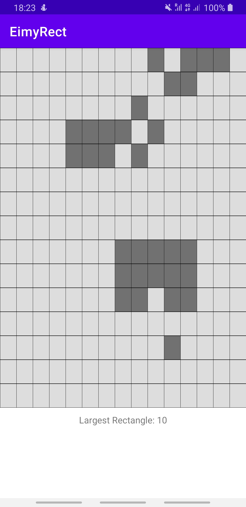

# Welcome to Largest Rectanngle Finder

It's a flip board game built using the Clean Architecture and MVVM.

## Architecture
App is developed with Clean Architecture to maintain sepration of concern.

### Domain Layer

This layer contains pure business logic independent of platform and independent of other layers. This layer contains:

  1.  Business Models
  2.  Use Cases

## Presentation Layer
This layer contains android specific code. it handles user interactions and actions.

## Test
This applications is covered with unit Test.

## CI
This applications has continuous integration using GitHub actions

## Libraries
  1.  Material Design - UI design
  2.  AndroidX - ViewModel, LiveData
  3.  Coroutine 
  4.  Dagger-Hilt -  Dependency Injection
  5.  Navigation Component - User 
  6.  Junit, mockk, flow turbine, Truth 

## NOTE
**Domain Layer model was developer to pass array and return modified array with highlighted rectangles.

## Backlog

UI Test and UI improvement

## Screenshots

 
